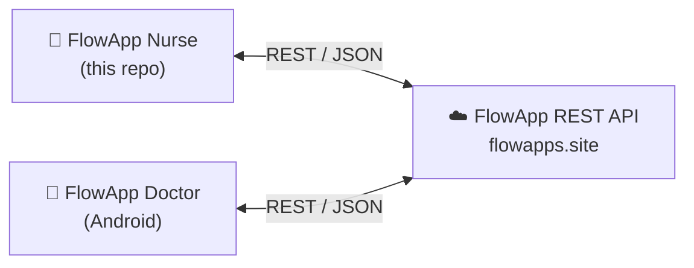

# FlowApp Nurse Android Application

A native Android application developed for nursing staff to manage digital health cards, patient treatments, and hospital announcements.

## Overview

This app acts as the clinical interface for nurses. It allows real-time tracking of patient treatment histories (Sanal Karne — digital health card), viewing hospital announcements, and interacting with the central hospital API.

## Part of the FlowApp Ecosystem

FlowApp is a two-sided hospital workflow system. This repository contains the **nurse-facing** app; doctors use a companion app, and both communicate with the same central REST API.

- 💉 **FlowApp Nurse** — this repository
- 🩺 **[FlowApp Doctor](https://github.com/ilaydasahin/FlowAppDoctor)** — companion app for physicians (patient inquiries, treatment approvals)
- ☁️ **FlowApp REST API** — central backend consumed by both apps (private)

## Features

- Authentication: Secure login for nursing staff.
- Patient Management: Access to patient records and treatment history.
- Digital Health Card (Sanal Karne): View and update applied treatments and vaccinations.
- Announcements: Real-time broadcast feed for hospital staff.

## Technology Stack

- Platform: Android, 100% Java (minSdk 24, targetSdk 34)
- Architecture: MVC — Activity/Fragment-based UI with RecyclerView adapters
- Networking: Retrofit2 + Gson converter, OkHttp with logging interceptor
- Persistence: Room
- UI: XML Layouts, RecyclerViews, Material Design
- Images: Picasso

## Build Instructions

1. Open project in Android Studio.
2. Sync Gradle files.
3. Build and deploy to an Android Emulator or physical device (API Level 24+).

## License

This project is licensed under the [MIT License](LICENSE).
